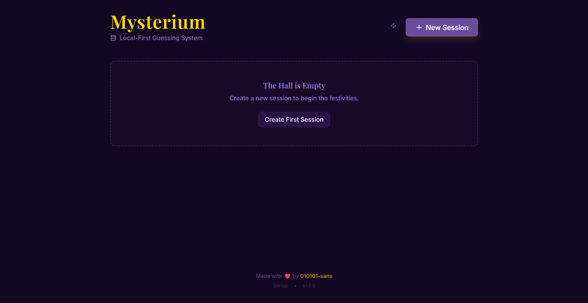
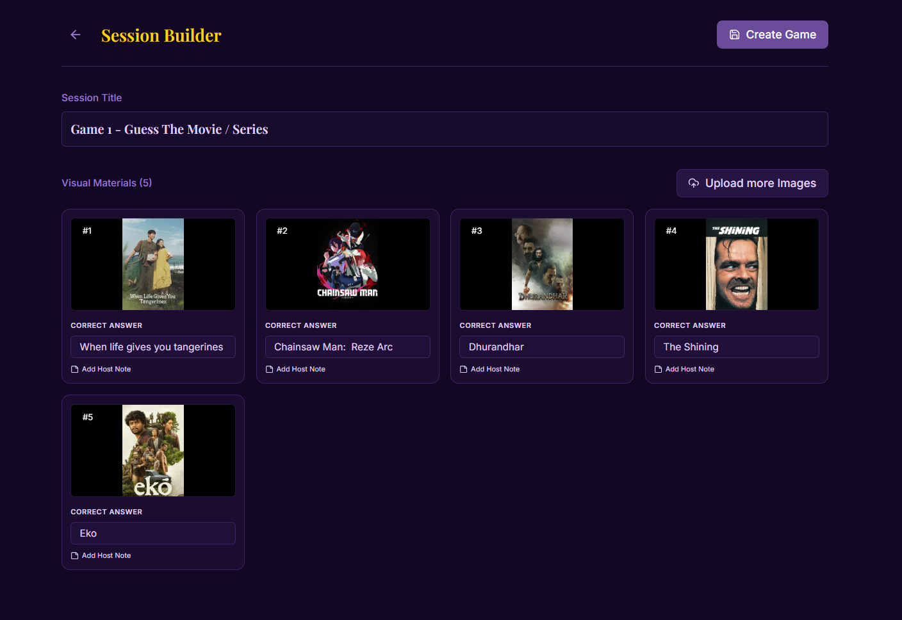
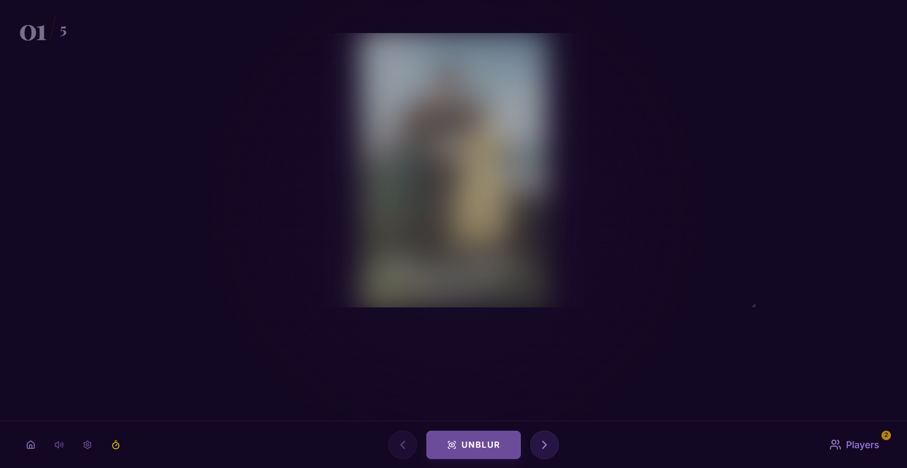
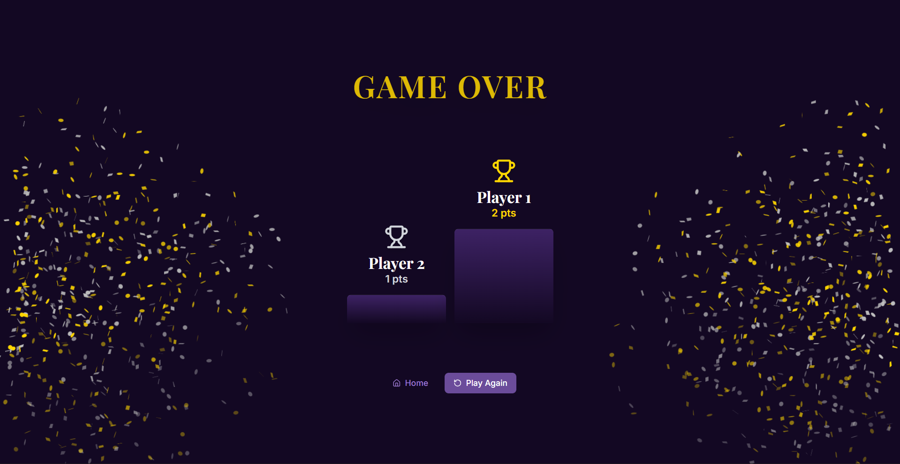

# 🔮 Mysterium

**A Local-First, Host-Controlled Guessing Game System**

## 📜 The Concept

**Mysterium** is a high-fidelity game engine designed for hosting interactive visual trivia sessions without the need for a backend server or internet connection.

Built with a **"Local-First" architecture**, it runs entirely in the browser using `IndexedDB` for storage. This ensures zero latency, complete privacy, and the ability to handle heavy image assets without server costs.

🔗 **Live Demo:** [010101-sans.is-a.dev/guessing-game](https://010101-sans.is-a.dev/guessing-game)

## ✨ Key Features

### 🏛️ The Architect (Session Builder)
* **Drag & Drop Grid:** Effortlessly organize dozens of images.
* **Host Notes:** Attach secret hints or trivia to images that only *you* can see.
* **Smart Parsing:** Automatically suggests answers based on filenames.

### 🎭 The Stage (Game Engine)
* **3-Step Reveal System:** Blur → Unblur → Answer + Notes.
* **Automated Timer:** Integrated countdowns that trigger reveals automatically.
* **Immersive Audio:** Built-in synthesis engine for SFX (No external assets required).

### 🏆 The Roster (Gamification)
* **Real-time Leaderboard:** Track scores for Solo Players or Teams (Red vs. Blue).
* **Podium Finish:** Automatic winner calculation with Gold/Silver/Bronze ceremony.
* **Confetti Engine:** Canvas-based particle physics for celebrations.

---

## 📸 Interface Gallery

| **The Lobby** | **Session Builder** |
|:---:|:---:|
|  |  |
| *Manage sessions & System health* | *Upload Images in session creation* |

| **The Stage** | **The Podium** |
|:---:|:---:|
|  |  |
| *The main gameplay interface* | *End-game celebration* |

## 🛠️ Architecture & Tech Stack

This project follows a **Serverless, Client-Side** architecture.

* **Core:** React 18, TypeScript, Vite
* **State & Storage:** `Dexie.js` (IndexedDB Wrapper) for persisting GBs of image data locally.
* **Styling:** Tailwind CSS with a CSS Variable abstraction layer for theming.
* **Motion:** `Framer Motion` for FLIP animations and layout transitions.
* **Audio:** Web Audio API (Oscillators) for generated sound effects.

## Author

- **Made with ❤️ by [010101-sans](https://github.com/010101-sans)**  
- **Star ⭐ this project repository if you liked Moctale Plus.**
